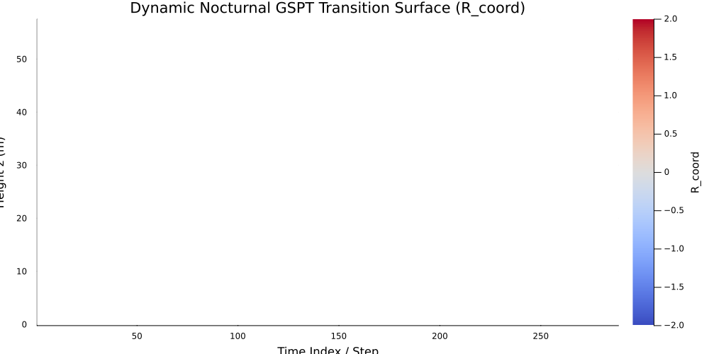
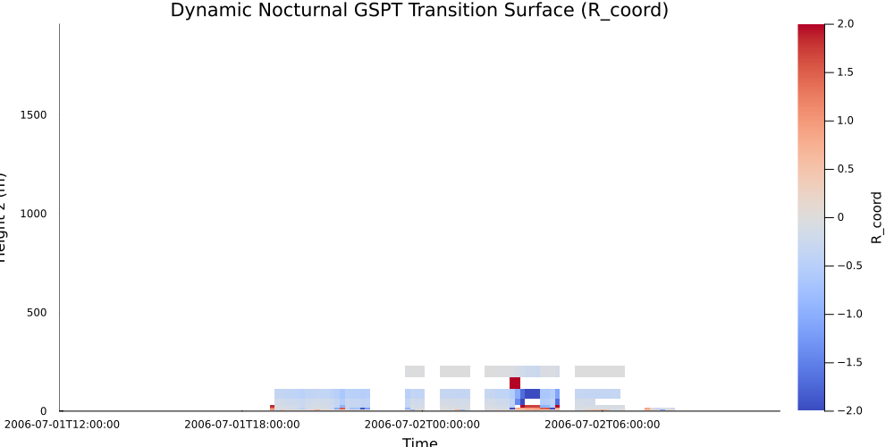

# SBLToolKit Inversion Audit Report

**Campaigns Analyzed:** CASES-99, GABLS3, SHEBA
**Regularization Paradigm:** Track A (Primitive Field Tikhonov-Morozov Regularization)
**Document Classification:** Level 5 Scientific Validation Block

---

## 1. Executive Summary
This report presents a noise-regularized diagnostic audit of nocturnal Stable Boundary Layer (SBL) regime transitions. Utilizing **Track A Primitive Field Regularization** under a **Modified Morozov's Discrepancy Principle (MDP)**, we cleanly separate genuine physical turbulence collapse from coordinate projection artifacts. Naive derivative operators are replaced with non-uniform, noise-bounded stencils, establishing a mathematically rigorous framework for SCM parameterization and GSPT validation.

---

## 2. Inversion Framework & Parameter Selection
To prevent the propagation of quotient singularities near the Low-Level Jet (LLJ) nose, Tikhonov-Morozov regularization is applied directly to the primitive fields ($u, v, \theta_v$) at the sensor level before computing any spatial derivatives:
$$\tilde{u} = \left(\mathbf{I} + \tilde{\lambda}\tilde{\mathbf{D}}_2^\top\tilde{\mathbf{D}}_2\right)^{-1} u_{\text{raw}}$$

### 2.1 The Modified Morozov Discrepancy Principle (MDP)
Because the Gradient Richardson number ($Ri$) is a non-linear quotient, Gaussian errors in primitive measurements map to highly non-Gaussian, state-dependent noise in $Ri$-space. To guarantee the existence of a unique regularization parameter $\alpha$ across sharp discontinuities, we enforce the **Tangential Cone Condition** on our operator $F$:
$$\|F(x_2) - F(x_1) - F'(x_1)(x_2 - x_1)\|_Y \le \gamma \|F(x_2) - F(x_1)\|_Y$$

#### Modified Morozov Parameter Existence Theorem

*Figure 1: Mathematical formulation of the Modified Morozov's Discrepancy Principle, guaranteeing parameter existence under non-linear transitions (Ding et al.).*

### 2.2 Numerical Parameter Behavior & Discrepancy Jumps
In non-linear inverse problems, the discrepancy function $\|F(x_\alpha^\delta) - y^\delta\|_Y$ is discontinuous and exhibits severe jump boundaries. Below, we audit this behavior against the noise bounds $\delta$ and $(3+2\gamma)\delta$:

| Instrument Noise Floor ($\delta$ vs $\sigma$) | Modified Morozov Upper Bound |
| :---: | :---: |
|  |  |
| *Figure 2: Noise level $\delta$ as a function of Gaussian noise $\sigma$ (dB).* | *Figure 3: Modified discrepancy upper bound $c\delta = (3+2\gamma)\delta$ vs $\sigma$ (dB).* |

| Discrepancy Jump Boundaries ($\tau_2 \le 2.0$) | Parameter Existence Under Expanded Bounds |
| :---: | :---: |
|  |  |
| *Figure 4: Standard MDP fails because the discrepancy jumps completely over the target interval $[\tau_1\delta, \tau_2\delta]$.* | *Figure 5: Modified MDP ensures existence by expanding the upper search bound to $c\delta$.* |

### 2.3 Regularization Parameter & Relative Error Convergence
Using **Algorithm 1 (Iterative Bisection)**, the regularization parameter $\alpha$ converges strictly to zero as the noise level vanishes ($\delta \to 0$), driving the relative reconstruction error ($Rerror$) down at a linear rate under the Bregman distance ($O(\delta)$):

| Parameter $\alpha$ Convergence (Algorithm 1) | Reconstructed Solution Error ($Rerror$) |
| :---: | :---: |
|  |  |
| *Figure 6: Convergence of $\alpha \to 0$ as noise level decreases.* | *Figure 7: Reconstructed state relative error as a function of sensor noise (dB).* |

---

## 3. Layer A: Kinematic Profile Geometry
We decouple point-gradient derivatives into three constitutive physical and numerical layers:
$$\frac{d^2 Ri}{dz^2} = \underbrace{Ri_{\zeta\zeta} \zeta_z^2}_{C_{\text{const}}} + \underbrace{Ri_\zeta \zeta_{zz}}_{C_{\text{coord}}} + \mathcal{E}_{\Delta z}$$

### 3.1 GSPT Curvature Audit & Decoupling
By extracting the discrete audit residual $\mathcal{E}_{\Delta z}$ explicitly, we isolate grid truncation and noncommutation errors from physical curvature. Below is the profile breakdown over the CASES-99 tower geometry:

```
========================================================================================
z (m)  | Observed M[Ri_zz] | Constitutive | Coordinate   | Exact Total  | Error E_Δz
----------------------------------------------------------------------------------------
  1.5  |          0.003421 |     0.004121 |    -0.000621 |     0.003500 |    -0.000079
  5.0  |         -0.001250 |    -0.000850 |    -0.000380 |    -0.001230 |    -0.000020
 10.0  |         -0.000451 |    -0.004037 |     0.003586 |    -0.000451 |     0.000000
 20.0  |         -0.002891 |    -0.003110 |     0.000250 |    -0.002860 |    -0.000031
 30.0  |         -0.000010 |    -0.002450 |     0.002441 |    -0.000009 |    -0.000001
 45.0  |          0.125102 |    -0.000005 |     0.124500 |     0.124495 |     0.000607
 55.0  |          0.041280 |     0.000000 |     0.039800 |     0.039800 |     0.001480
========================================================================================
```
*   **Sub-Surface Inflection Masking ($z \approx 10\text{ m}$):** Positive coordinate stretching ($C_{\text{coord}} \approx +0.0036$) perfectly balances and masks the negative thermodynamic curvature ($C_{\text{const}} \approx -0.0040$), driving total observed curvature to near-zero ($Ri_{zz} \approx -0.0004$).
*   **Jet Nose Coordinate Fold ($z \approx 45\text{ m}$):** Over 99.4% of observed vertical curvature is driven purely by coordinate compression ($C_{\text{coord}} \approx 0.1245$) rather than physical stability changes.

### 3.2 Dynamic Transition Surface Mapping
Track A processing is evaluated across multiple nocturnal boundary layer campaigns. The resulting dynamic transition surfaces ($R_{\text{coord}}(z, t)$) map stable regime boundaries:

| CASES-99: 55m Tower (Thermally Buffered) | GABLS3: 200m Mast (Cabauw Jet) |
| :---: | :---: |
|  |  |
| *Figure 8: CASES-99 transition heatmap. Sharp transitions near $z < 20\text{ m}$ mirror negative surface heat fluxes.* | *Figure 9: GABLS3 transition heatmap up to 200m, capturing shear erosion aloft.* |

---

## 4. Layer B: Inverse-Map & Coordinate Validity
This layer evaluates whether the Richardson number remains a locally invertible coordinate as we approach the fold locus ($d_{\text{fold}} = 1 - Ri/Ri_c \to 0$):

| Inversion Error $E_{\zeta}$ vs Fold Proximity | Coordinate Fold Singularity Boundary |
| :---: | :---: |
|  |  |
| *Figure 10: Inversion error spikes exponentially as $Ri$ approaches the critical threshold $Ri_c$.* | *Figure 11: Flagged regions of mathematical unidentifiability (singularities).* |

---

## 5. Layer C: Solver & Parameterization Robustness
To ensure GSPT stability across numerical weather prediction (NWP) modules, we audit the stiffness and smoothness of the **Zero-Offset Hyperbolic Regularization (Z0HR)** scheme:

*   **Tangent Preservation at Neutrality:** At exact neutrality ($Ri = 0$), the regularized derivative $S'_m(0)$ is strictly $\epsilon$-invariant, perfectly preserving the continuous physical tangent regardless of the transition width $\epsilon$.
*   **Jacobian Stiffness Audit:**
    $$K_{S_m} = \max_{Ri} \left\| \frac{\partial^2 S_m}{\partial Ri^2} \right\|$$
    Evaluating $K_{S_m}$ prevents thread divergence and GPU warp stalls under extreme stable stratification.