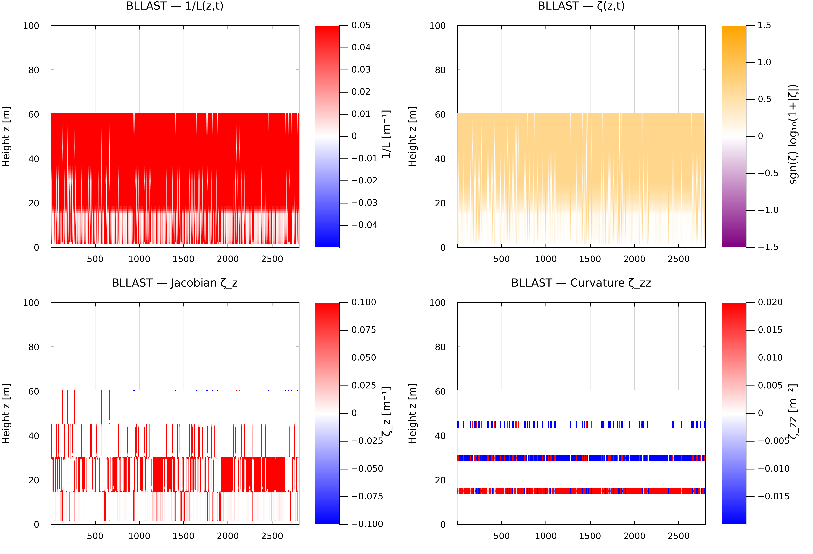
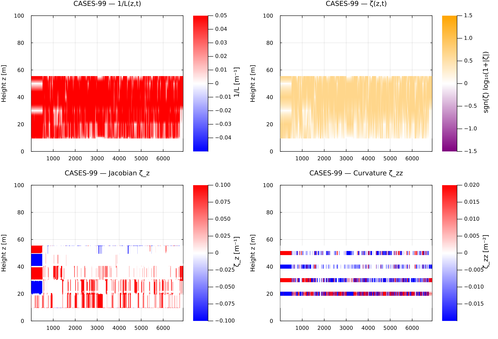
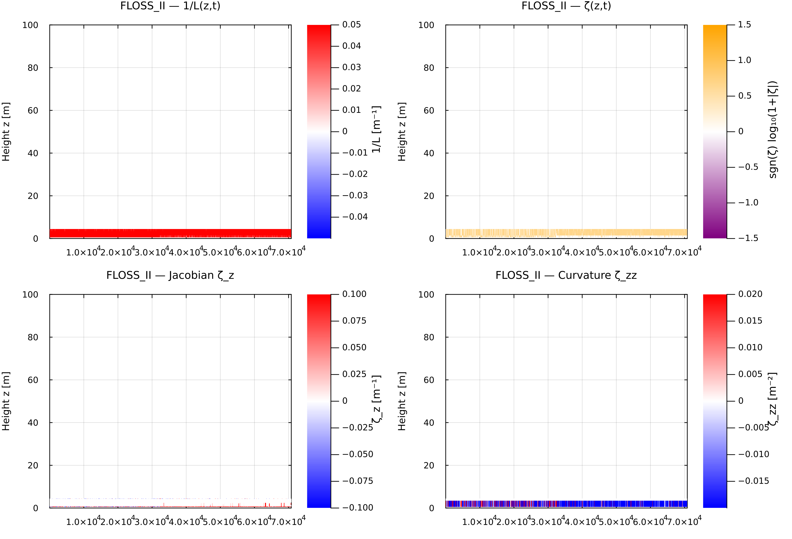
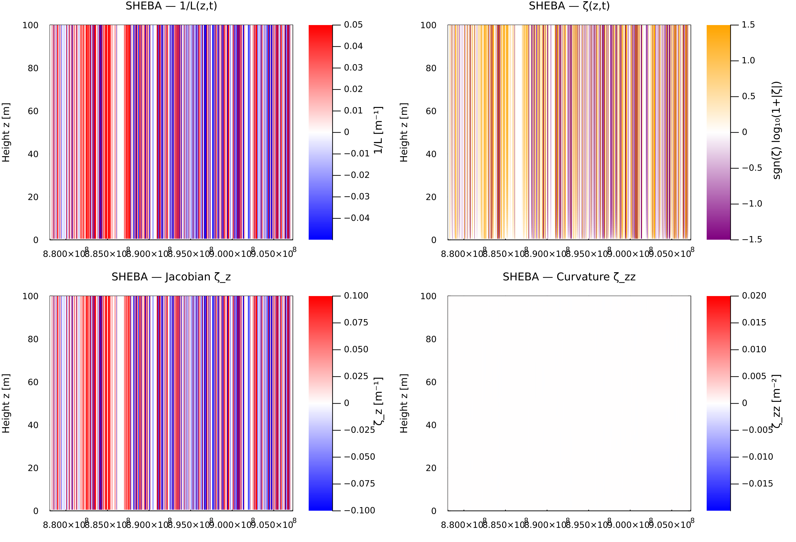
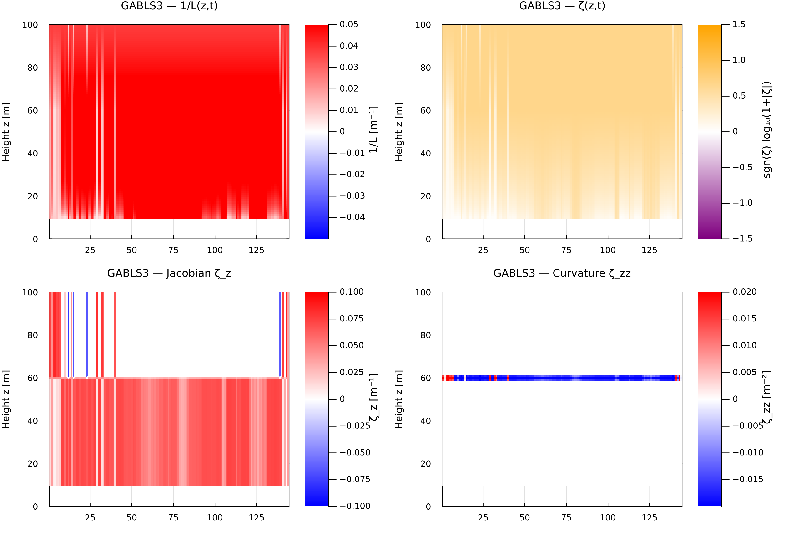

# Observational Obukhov Stability Heatmaps

This document provides multi-panel spatiotemporal heatmaps evaluating local Monin–Obukhov stability structure across five boundary-layer field campaigns, standardized on a uniform $z \in [1, 100]\text{ m}$ vertical evaluation grid.

## Analytical Panel Structure

Each campaign diagnostic panel consists of four synchronized $(t, z)$ heatmaps derived from local gradient Richardson profiles $Ri_g(z,t)$ and surface fluxes:

* **Reciprocal Obukhov Length $1/L(z,t)$ $[m^{-1}]$:** Quantifies local buoyant flux scaling across height. Positive values denote stable stratification; negative values indicate convective instability.
* **Stability Parameter $\zeta(z,t)$:** Normalized height ratio $\zeta = z/L$, displayed using a symmetric log transform $\text{sgn}(\zeta)\log_{10}(1 + \vert{}\zeta\vert{})$ to resolve near-neutral surface transitions alongside strongly stable aloft regimes.
* **Jacobian $\zeta_z = \frac{\partial \zeta}{\partial z}$ $[m^{-1}]$:** First vertical derivative computed via non-uniform centered stencil operators. White overlay contours trace the $\zeta_z = 0$ inflection boundary.
* **Curvature $\zeta_{zz} = \frac{\partial^2 \zeta}{\partial z^2}$ $[m^{-2}]$:** Second vertical derivative identifying internal shear boundaries, inversion capping heights, and turbulent-to-laminar transition layers.

---

## Campaign Comparisons & Diagnostics

| Campaign | Site Location & Surface Type | Native Profile Source | Dominant Stability Dynamics |
| --- | --- | --- | --- |
| **BLLAST** | Plateau de Lannemezan, France (heterogeneous vegetation) | Multi-level $Ri_g$ profile wide arrays | Afternoon decay, residual-layer decoupling, transition turbulence |
| **CASES-99** | Kansas, USA (flat grassland) | High-resolution tower $Ri_g$ profiles | Strong nocturnal inversions, Low-Level Jet (LLJ) shear |
| **FLOSS-II** | North Park, Colorado, USA (snow cover) | Tower profile array ($1\text{--}30\text{ m}$) | Strongly stable stratification, drainage flows, gravity wave activity |
| **SHEBA** | Beaufort Sea Ice Pack (Arctic ocean) | Surface flux extraction ($u_*, H_s$) | Persistent Arctic stability, low surface heat fluxes, sea-ice decoupling |
| **GABLS3** | Cabauw, Netherlands (flat grassland) | Cabauw 200m tall mast profiles | Benchmark diurnal cycle, sharp nocturnal boundary layer growth |

---

## Campaign Heatmaps

### BLLAST (Boundary-Layer Late Afternoon and Sunset Turbulence)

Captures the transition phase from convective turbulence to nocturnal stability over heterogeneous terrain.

### CASES-99 (Cooperative Atmosphere-Surface Exchange Study)

High-resolution vertical structure depicting strong nighttime surface cooling and wind-shear interactions under stable nocturnal low-level jets.

### FLOSS-II (Fluxes Over Snow Surfaces II)

Characterized by extreme surface stability, shallow boundary-layer heights, and intense thermal stratification over winter snowpack.

### SHEBA (Surface Heat Budget of the Arctic Ocean)

Long-term Arctic ice pack dynamics showing persistent weak-to-strong stability regimes dominated by longwave radiative cooling.

### GABLS3 (GEWEX Atmospheric Boundary Layer Study)

Tall-tower observational benchmark illustrating clean diurnal transitions, surface layer decoupling, and inversion elevation up to $100\text{ m}$.