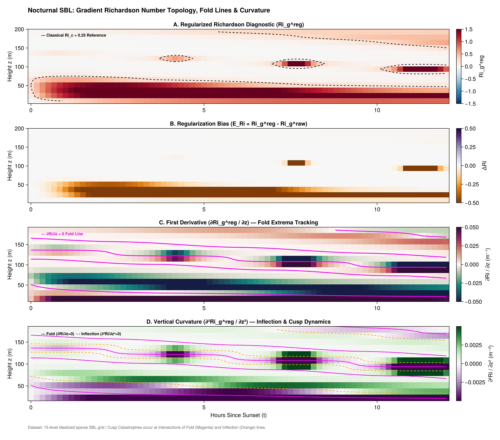

**Diagnostic Overview: Idealized Nocturnal Stable Boundary Layer (SBL)**

This four-panel diagnostic suite illustrates the spatial-temporal evolution of the gradient Richardson number ($Ri_g$), its visualization regularization distortion, and its higher-order vertical topology across a synthetic 12-hour nocturnal cycle ($0 \le t \le 12\text{ h}$) sampled on a 15-level idealized tower grid ($2 \le z \le 200\text{ m}$, $\Delta z \approx 14.1\text{ m}$).

The underlying flow is driven by two coupled physical mechanisms: progressive surface radiative cooling producing a surface-based potential temperature inversion ($h_\theta = 45\text{ m}$), and a descending Low-Level Jet (LLJ) in the $u$-wind component (core descending from $140\text{ m}$ to $90\text{ m}$ with speeds peaking at $12\text{ m s}^{-1}$) combined with Ekman turning in $v$.

---

**Panel-by-Panel Scientific Breakdown**

* **Panel A: Regularized Richardson Field ($Ri_g^{\text{reg}}$)**
Displays the bounded diagnostic state variable mapped smoothly into $[-1.5, 1.5]$. Strong sub-jet shear production maintains a low Richardson number ($Ri < 0.25$) near the surface and directly beneath the descending jet core. Above the jet core, buoyancy suppression dominates, producing a supercritical laminar layer ($Ri > 0.25$). The dashed black contour indicates the classical empirical transition boundary ($Ri_c = 0.25$).
* **Panel B: Regularization Bias ($E_{Ri} = Ri_g^{\text{reg}} - Ri_g^{\text{raw}}$)**
Quantifies the explicit mathematical distortion introduced by the visualization transform $R_b \tanh(Ri^{\text{raw}} / R_b)$ and shear floor $S^2_{\text{min}}$. Bias is zero across active mixing and weakly stable zones ($Ri \approx 0$), but becomes large negative ($E_{Ri} \ll 0$) in weak-shear, hyper-stable aloft layers where $Ri_g^{\text{raw}} \gg R_b$, explicitly isolating regularizer artifacts from physical dynamics.
* **Panel C: First Spatial Derivative ($\partial Ri_g^{\text{reg}} / \partial z$) — Fold Locus**
Maps the rate of vertical change in stability. Superimposed solid magenta contours locate the fold locus ($\partial Ri_g / \partial z = 0$), tracking the exact spatial-temporal trajectory of Richardson number local minima (shear maxima under the LLJ) and local maxima (buoyancy-dominated regions above the jet core).
* **Panel D: Vertical Curvature ($\partial^2 Ri_g^{\text{reg}} / \partial z^2$) — Inflection & Cusp Dynamics**
Details profile concavity and boundary layer layering. Dashed orange contours highlight profile inflection points ($\partial^2 Ri_g / \partial z^2 = 0$). Intersections between the solid magenta fold lines ($\partial Ri / \partial z = 0$) and dashed orange inflection lines ($\partial^2 Ri / \partial z^2 = 0$) mark geometric cusp catastrophe points where local stratification folds nucleate or collapse over the nocturnal cycle.