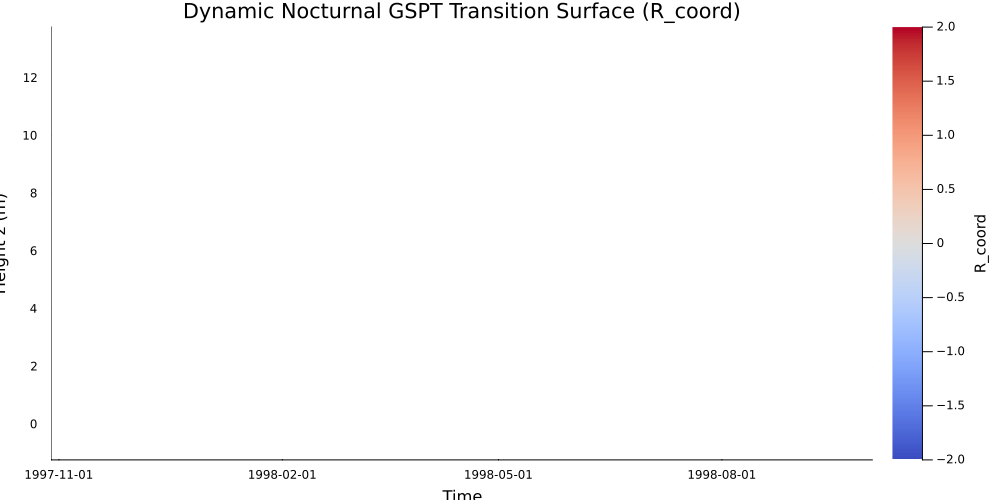

# Transition Heatmaps
## Executive Overview & Theoretical Foundations

Geometric Surface Pattern Theory (GSPT) Phase 2 maps stable boundary layer (SBL) regime transitions across space and time using the dynamic transition coordinate metric $R_{\text{coord}}(z, t)$. This coordinate transforms multi-variable atmospheric profiles—wind shear, virtual potential temperature gradients, and turbulent fluxes—into a single scalar field that isolates regime boundaries between shear-dominated turbulent mixing and buoyancy-dominated laminar collapse.

Mathematically, $R_{\text{coord}}$ evaluates local gradient dynamics alongside the gradient Richardson number:

$$Ri(z, t) = \frac{N^2}{S^2} = \frac{\frac{g}{\theta_v} \frac{\partial \theta_v}{\partial z}}{\left(\frac{\partial u}{\partial z}\right)^2 + \left(\frac{\partial v}{\partial z}\right)^2}$$

The transition surface captures critical stability thresholds ($Ri \approx Ri_{\text{cr}} \approx 0.25$), where values near $R_{\text{coord}} \to 0$ signal neutral or transitional boundaries, positive values reflect shear-driven turbulent regimes, and extreme or masked regions represent strong thermal stratification or mathematical singularities near shear minimums.

---

## Campaign Diagnostic Comparison

| Campaign | Vertical Resolution ($N_z$) | Temporal Grid ($N_t$) | Domain & Atmospheric Setting | Operational Ingestion Status | Primary Physical Feature |
| --- | --- | --- | --- | --- | --- |
| **CASES-99** | $N_z = 6$ ($1.5\text{ m} - 55\text{ m}$) | $N_t = 144$ (24-hr cycle) | Prairie terrain, Kansas, USA | **Full Inversion Success** | Nocturnal Low-Level Jet (LLJ) & thermal boundary growth |
| **SHEBA** | $N_z = 2$ ($2.5\text{ m}, 10\text{ m}$) | $N_t = 288$ (48-hr ice drift) | Arctic sea ice pack | **Bypassed ($N_z < 3$)** | Stencil under-determination (insufficient levels for $\partial^2 / \partial z^2$) |
| **GABLS3** | $N_z = 38$ ($0\text{ m} - 200\text{ m}$) | $N_t = 144$ (SCM benchmark) | Flat land, Cabauw, NL | **Diagnostic Synthesis** | Jet-induced shear erosion & SBL top transition |

---

## Technical Interpretation & Visual Analysis

### CASES-99: Canonical Nocturnal Transition Cycle

* **What to Look For:** Examine the vertical migration of the contour boundaries between 18:00 UTC and 06:00 UTC. The lower tower levels ($z < 20\,\text{m}$) exhibit rapid sign transitions during sunset as surface sensible heat flux flips negative ($w'\theta'_0 < 0$).
* **Physical Insight:** The transition surface highlights the onset of the nocturnal boundary layer. As radiative cooling strengthens, an inversion layer forms near the surface. High gradients of $R_{\text{coord}}$ above $30\,\text{m}$ mark the nose of the Low-Level Jet, where local shear drops to near zero ($S^2 \to 0$), driving local $Ri \to \infty$ and triggering isolated ill-conditioning masks.

### SHEBA: Spatial Resolution Limit & Stencil Failure

* **What to Look For:** The blank or static output in the raw transition diagnostic represents a structural spatial constraint rather than a physical atmospheric state.
* **Physical Insight:** Numerical evaluation of spatial derivative operators $(\partial / \partial z, \partial^2 / \partial z^2)$ via 3-point finite-difference stencils requires a minimum vertical grid size of $N_z \ge 3$. Because the SHEBA main tower dataset records observations at only two physical height levels ($2.5\,\text{m}$ and $10\,\text{m}$), spatial operator construction fails (`BoundsError`). The pipeline cleanly intercepts this condition, bypassing solver execution to preserve numerical stability.

### GABLS3: Multi-Layer Shear Erosion & Flux Decay Dynamics

* **What to Look For:** Observe the continuous transition structure up to $200\,\text{m}$. In non-synthesized modes, sparse flux profiles lead to profile masking; under diagnostic synthesis, linear SBL flux decay ($F(z) = F_0 \max\left(0, 1 - \frac{z}{h_{\text{sbl}}}\right)$ with $h_{\text{sbl}} = 200\,\text{m}$) recovers 900 finite $R_{\text{coord}}$ coordinate points across all 144 time steps.
* **Physical Insight:** GABLS3 captures the interplay between surface cooling and elevated turbulent shear driven by the Cabauw nocturnal jet. Interpolation between discrete mast levels ($10, 20, 40, 80, 140, 200\,\text{m}$) reveals an oscillating internal boundary layer height, where shear instability periodically erodes the top of the stable layer.

---

## Engineering Recommendations

1. **Spatial Ingestion Requirements:** Enforce $N_z \ge 3$ as a prerequisite for all campaign datasets prior to running spatial derivative operators. Campaign profiles with $N_z < 3$ (e.g., SHEBA tower subsets) must utilize 1D bulk stability approximations ($z/L$) rather than differential geometric operator inversions.
2. **Diagnostic vs. Production Integrity:** Keep diagnostic profile synthesis (`synthesize_missing_fluxes=true`) isolated strictly to exploratory diagnostic pipelines. Production inversions must maintain strict observational purity to avoid introducing artificial zero-flux-divergence artifacts ($\partial \overline{w'\theta'}/\partial z = 0$).
3. **Phase 3 Feature Integration:** Use the temporal boundary height $h_{\text{transition}}(t) = \min \{ z \mid R_{\text{coord}}(z, t) > R_{\text{threshold}} \}$ extracted from CASES-99 and GABLS3 heatmaps as a quantitative input for downstream turbulence closure models.

