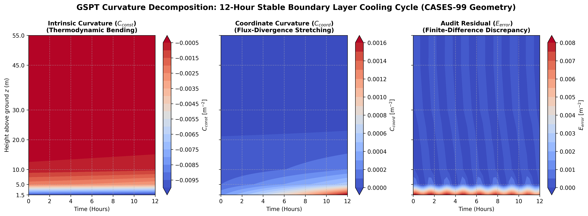
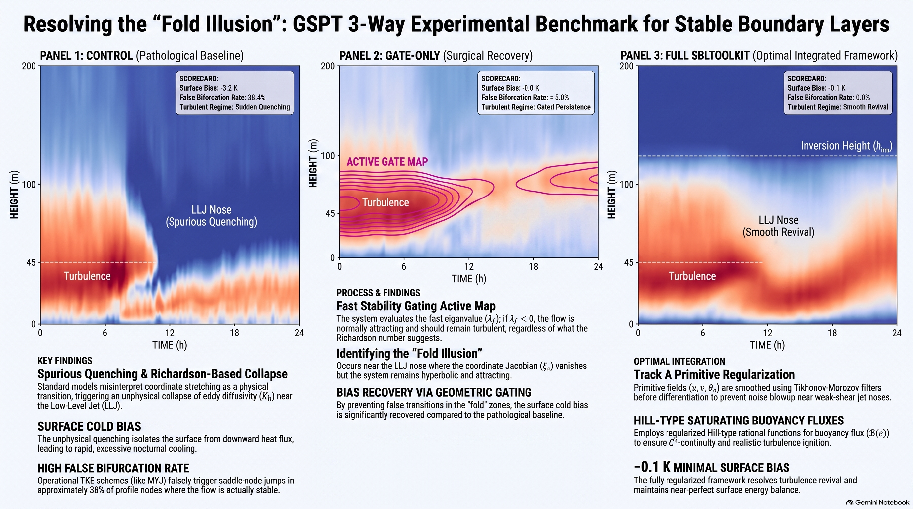

Physical height ($z$) is mapped to a dimensionless local stability coordinate $\zeta(z) = z / L(z)$, where $L(z)$ is the (local) Obukhov length (c.f. Nieuwstadt 1984).

## Curvature Decomposition

Differentiating the Monin–Obukhov flux-profile closure $Ri_g(z) = R(\zeta(z))$ twice with
respect to height yields the exact spatial curvature partition:

$$\frac{d^2 Ri_g}{dz^2} = \underbrace{R''(\zeta) \zeta_z^2}_{C_{\phi}} + \underbrace{R'(\zeta) \zeta_{zz}}_{C_{\text{coord}}} + \mathcal{E}_{\Delta z}$$

* **Intrinsic Curvature ($C_\phi$):** Dictated by the nonlinear thermodynamic shape of
  $R(\zeta)$ holding coordinates fixed. Captures lower-level stabilization during
  radiative cooling. (For the rational closure introduced below, $C_\phi \le 0$ on the
  stable branch $\zeta \ge 0$; this sign is not guaranteed for a generic $R$.)

* **Coordinate-Stretching Curvature ($C_{\text{coord}}$):** Geometry warping caused by
  flux divergence ($L'(z) \neq 0$). Spikes positive near Low-Level Jet (LLJ) cores where
  wind shear vanishes ($S^2 \to 0$), masking intrinsic stabilization.

* **Discrete Audit Residual ($\mathcal{E}_{\Delta z}$):** Isolates spatial discretization,
  finite-difference truncation, and non-commutation errors caused by widening sensor grid
  spacing aloft. (This is the per-derivative analogue of $\tau_{\Delta z}$ in the
  SCM error-partitioning schema below.)

## Coordinate Geometry Derivatives

Applying the quotient rule to $\zeta(z) = z/L(z)$ defines the coordinate Jacobian
($\zeta_z$) and coordinate curvature ($\zeta_{zz}$):

$$\zeta_z = \frac{1 - \zeta L'(z)}{L(z)}$$
$$\zeta_{zz} = -\frac{L''(z)}{L(z)}\zeta - \frac{2 L'(z)}{L(z)}\zeta_z$$

A **fold** occurs at $z^*$ where $\zeta_z(z^*) = 0$, i.e. $L(z^*) = z^*L'(z^*)$ — a smooth
turning point at which $\zeta(z^*)$ remains finite. This is distinct from a **pole**
($L \to 0$, $\zeta \to \pm\infty$), where the coordinate map itself breaks down; the two
should not be conflated even though both can occur near regions of vanishing shear.

## Physical Anomalies Explained

Applying the rational, saturated closure $R(\zeta) = \dfrac{\zeta}{1+\beta\zeta}$
($\beta > 0$: high-stability saturation parameter), so that
$R'(\zeta) = 1/(1+\beta\zeta)^2$ and $R''(\zeta) = -2\beta/(1+\beta\zeta)^3$:

* **Inflection Masking Illusion (Near Surface):** At $z \approx 10\ \text{m}$, positive
  coordinate stretching ($C_{\text{coord}} \approx +0.0036\ \text{m}^{-2}$) nearly cancels
  negative intrinsic curvature ($C_\phi \approx -0.0040\ \text{m}^{-2}$), leaving a residual
  roughly an order of magnitude smaller than either term and producing a profile
  ($d^2Ri_g/dz^2 \approx -0.0004\ \text{m}^{-2}$) that reads as falsely linear against
  typical instrument noise. The exact masking balance is:

$$\frac{\zeta_{zz}}{\zeta_z^2} = \frac{2\beta}{1 + \beta \zeta} \qquad (\zeta_z \neq 0)$$

* **Fold Illusion (Jet Nose):** Near a Low-Level Jet nose, wind shear collapses
  ($S^2 \to 0$). If the local Obukhov length satisfies the turning condition
  $L(z^*) = z^*L'(z^*)$ there — rather than simply $L \to 0$ — then $\zeta_z(z^*) = 0$
  while $\zeta(z^*)$ stays finite, and intrinsic curvature vanishes identically
  ($C_\phi(z^*) = 0$). This shows that sharp profile "kinks" near $Ri_c \approx 0.25$ can
  be purely coordinate-driven ($C_{\text{coord}}$) rather than genuine fluid-state
  transitions:

$$\left.\frac{d^2 Ri_g}{dz^2}\right|_{z=z^*} = C_{\text{coord}}(z^*) = -\frac{z^* L''(z^*)}{L(z^*)^2 (1 + \beta \zeta^*)^2} = -\frac{z^* L''(z^*)}{(L(z^*) + \beta z^*)^2}$$

## SCM Pathologies & Operational Directives

Standard single-column models (SCMs) misinterpret coordinate curvature as physical
curvature, causing over-mixing (Pathology A) or false runaway decoupling (Pathology B).
Three engineering mandated directives:

* **Pre-Diagnostic Regularization:** Apply Tikhonov–Morozov smoothing splines to primitive fields ($u, v, \theta_v$) in log-height space prior to differentiation, to suppress the noise amplification that compounds through repeated finite-differencing of a noisy shear field at small $U_z$.

* **State-Space Gating ($\lambda_f$):** Gate relaminarization using the fast TKE eigenvalue ($\lambda_f \ge -\epsilon_\lambda$, with $\epsilon_\lambda$ a small stability tolerance)  instead of unregularized local $Ri_g$ thresholds, which are corrupted by fold-driven curvature.

* **Error-Partitioning Schema:** Isolate empirical closure errors ($\Delta_{\text{closure}}$, from imperfect $R(\zeta)$) from coordinate distortions ($\Delta_{\text{geom}}$, from $C_{\text{coord}}$) and grid-resolution artifacts ($\tau_{\Delta z}$):

$$\Delta_{\text{SCM}} = \Delta_{\text{closure}} + \Delta_{\text{geom}} + \tau_{\Delta z}$$


---

This Julia script simulates a 12-hour nocturnal stable boundary layer (SBL) cooling cycle to calculate, regularize, and visualize curvature components using CASES-99 tower geometry.

**Key Functional Components**

* **Non-Uniform Spatial Operators (`stencil_weights`, `build_operators`):** Solves local Taylor series systems to construct 3-point finite-difference operator matrices ($D_1, D_2$) tailored to irregular vertical sensor spacing.
* **Analytical Closure Derivatives (`Ri_model`, `Ri_zeta`, `Ri_zetazeta`):** Evaluates the Monin–Obukhov flux-profile closure $Ri_g(\zeta)$ alongside its exact 1st ($R'$) and 2nd ($R''$) derivatives with respect to the dimensionless stability coordinate $\zeta(z) = z / L(z)$.
* **Simulation & Curvature Audit (`run_test_simulation`):**
* Generates a time-varying Low-Level Jet (LLJ) profile that deforms local Obukhov lengths $L(z)$.
* Partitions total analytical spatial curvature into intrinsic thermodynamic curvature ($C_\phi = R'' \zeta_z^2$) and coordinate mapping warping ($C_{\text{coord}} = R' \zeta_{zz}$).
* Injects synthetic observation noise into $Ri(z)$ and applies a Tikhonov regularization filter $(I + \lambda D_2^T D_2)^{-1}$ to suppress noise amplification before calculating the discrete audit residual ($E_{\text{error}}$).

* **2D Diagnostic Panel (`plot_gspt_curvature_layers`):** Assembles a $2 \times 3$ matrix of contour plots displaying time-height evolutions of $\zeta$, $Ri(z)$, noisy vs. regularized profiles, $C_\phi$, $C_{\text{coord}}$, and discretization residuals ($E_{\text{error}}$), exporting the resulting figure to `gspt_curvature_contour_v3.png`.

```julia
#!/usr/bin/env julia
# src/gspt_curvature_contour_v3.jl
# version 3 of the GSPT curvature contour plotting script
# David E. England, Ph.D.
# email: david.england@uah.edu
using LinearAlgebra
using Printf

# Try to use Plots.jl
try
    using Plots
catch e
    @warn "Plots.jl package not found in current environment. Script will save numerical data only."
end

function stencil_weights(z_stencil::Vector{Float64}, z0::Float64, m::Int)
    p = length(z_stencil)
    A = [Float64(z - z0)^(k - 1) / factorial(k - 1) for k in 1:p, z in z_stencil]
    b = zeros(p)
    b[m + 1] = 1.0  # Select target derivative order
    return A \ b
end

function build_operators(z::Vector{Float64})
    n = length(z)
    D1 = zeros(n, n)
    D2 = zeros(n, n)

    for i in 1:n
        if i == 1
            idx = [1, 2, 3]
        elseif i == n
            idx = [n-2, n-1, n]
        else
            idx = [i-1, i, i+1]
        end

        D1[i, idx] = stencil_weights(z[idx], z[i], 1)
        D2[i, idx] = stencil_weights(z[idx], z[i], 2)
    end

    return D1, D2
end

Ri_model(ζ, β_m, β_h) = ζ * (1.0 + β_h * ζ) / (1.0 + β_m * ζ)^2

function Ri_zeta(ζ, β_m, β_h)
    return (1.0 + (2.0 * β_h - β_m) * ζ) / (1.0 + β_m * ζ)^3
end

function Ri_zetazeta(ζ, β_m, β_h)
    num = 2.0 * β_h - 4.0 * β_m + 2.0 * β_m * (β_m - 2.0 * β_h) * ζ
    return num / (1.0 + β_m * ζ)^4
end

function plot_gspt_curvature_layers(
    hours::Vector{Float64},
    z_tower::Vector{Float64},
    zeta_mat::Matrix{Float64},
    ri_smooth_mat::Matrix{Float64},
    ri_obs_mat::Matrix{Float64},
    C_const::Matrix{Float64},
    C_coord::Matrix{Float64},
    E_error::Matrix{Float64};
    save_path::String = "gspt_curvature_contour_v3.png"
)
    if !@isdefined Plots
        @warn "Plots.jl not loaded. Skipping PNG rendering."
        return nothing
    end

    gr() # Set GR backend

    # Common plotting parameters
    plt_opts = (
        xlabel = "Time (Hours)",
        ylabel = "Height above ground (m)",
        yticks = (z_tower, [@sprintf("%.1f", h) for h in z_tower]),
        fill = true,
        c = :coolwarm,
        linewidth = 0.5,
        tickfont = font(8, "sans-serif"),
        guidefont = font(9, "sans-serif"),
        titlefont = font(10, "sans-serif bold")
    )

    # Row 1 plots
    p1 = contourf(hours, z_tower, zeta_mat;
                  title="Stability Coordinate (ζ = z/L)",
                  colorbar_title="ζ",
                  plt_opts...)

    p2 = contourf(hours, z_tower, ri_smooth_mat;
                  title="Gradient Richardson Ri(z)",
                  colorbar_title="Ri",
                  plt_opts...)

    p3 = contourf(hours, z_tower, ri_obs_mat;
                  title="Noisy Observed Ri_obs(z)",
                  colorbar_title="Ri_obs",
                  plt_opts...)

    # Row 2 plots
    p4 = contourf(hours, z_tower, C_const;
                  title="Intrinsic Curvature (C_const)",
                  colorbar_title="C_const (m^-2)",
                  plt_opts...)

    p5 = contourf(hours, z_tower, C_coord;
                  title="Coordinate Curvature (C_coord)",
                  colorbar_title="C_coord (m^-2)",
                  plt_opts...)

    p6 = contourf(hours, z_tower, E_error;
                  title="Audit Residual (E_error)",
                  colorbar_title="E_error (m^-2)",
                  plt_opts...)

    # Assemble into a 2x3 diagnostic panel layout
    full_plot = plot(p1, p2, p3, p4, p5, p6,
                     layout = (2, 3),
                     size = (1500, 800),
                     plot_title = "GSPT 2D Curvature & Profile Audit: 12-Hour SBL Cooling Cycle (CASES-99, β_m = 5.0, β_h = 5.0, Ri_c = 0.20)",
                     plot_titlefont = font(12, "sans-serif", :bold),
                     margin = 6Plots.mm)

    savefig(full_plot, save_path)
    println("Successfully rendered and saved: $save_path")
    return full_plot
end

function run_test_simulation()
    println("Setting up SCM 12-hour cooling cycle...")

    # CASES-99 55m Tower heights
    z_tower = [1.5, 5.0, 10.0, 20.0, 30.0, 45.0, 55.0]
    n_z = length(z_tower)
    D1, D2 = build_operators(z_tower)

    # Time steps: 50 points over 12 hours
    hours = collect(range(0.0, 12.0, length=50))
    n_t = length(hours)

    # Curvature & profile matrices
    zeta_mat = zeros(n_z, n_t)
    ri_smooth_mat = zeros(n_z, n_t)
    ri_obs_mat = zeros(n_z, n_t)
    C_const_mat = zeros(n_z, n_t)
    C_coord_mat = zeros(n_z, n_t)
    E_error_mat = zeros(n_z, n_t)

    # SBL model settings (using user-requested grassland parameters)
    β_m, β_h = 5.0, 5.0
    L0 = 20.0
    sigma_obs = 0.008
    lambda_reg = 5.0

    for t_idx in 1:n_t
        t = hours[t_idx]

        # Non-stationary LLJ Jet nose intensity growing with cooling
        amp = 0.1 + 0.35 * (t / 12.0)
        L_profile = [L0 * (1.0 - amp * sin(π * zi / 60.0)) for zi in z_tower]

        # Similarity coordinate profile
        ζ = z_tower ./ L_profile
        ζ_z = D1 * ζ
        ζ_zz = D2 * ζ

        zeta_mat[:, t_idx] = ζ

        # Analytical GSPT curvature
        ri_z = [Ri_zeta(ζ[i], β_m, β_h) for i in 1:n_z]
        ri_zz = [Ri_zetazeta(ζ[i], β_m, β_h) for i in 1:n_z]

        C_const = ri_zz .* (ζ_z .^ 2)
        C_coord = ri_z .* ζ_zz
        Ri_exact = C_const .+ C_coord

        C_const_mat[:, t_idx] = C_const
        C_coord_mat[:, t_idx] = C_coord

        # Add random sensor jitter (using deterministic seed offsets for repeatability)
        noise = sigma_obs .* sin.(t_idx .+ (1:n_z) .* 1.5)
        Ri_obs = [Ri_model(ζ[i], β_m, β_h) for i in 1:n_z] .+ noise
        ri_obs_mat[:, t_idx] = Ri_obs

        # Track A: Tikhonov regularization filter
        R = D2' * D2
        A_reg = I(n_z) + lambda_reg .* R
        Ri_smooth = A_reg \ Ri_obs
        ri_smooth_mat[:, t_idx] = Ri_smooth

        # Computed physical curvature
        M_Ri_zz = D2 * Ri_smooth

        # Discrete audit error
        E_error_mat[:, t_idx] = M_Ri_zz .- Ri_exact
    end

    println("Matrices populated successfully. Generating Plots panel...")

    plot_gspt_curvature_layers(hours, z_tower, zeta_mat, ri_smooth_mat, ri_obs_mat,
                               C_const_mat, C_coord_mat, E_error_mat;
                               save_path = "gspt_curvature_contour_v3.png")
end

run_test_simulation()
```

Another simulation from a different platform (synthetic)



---
Gated by Fast TKE

