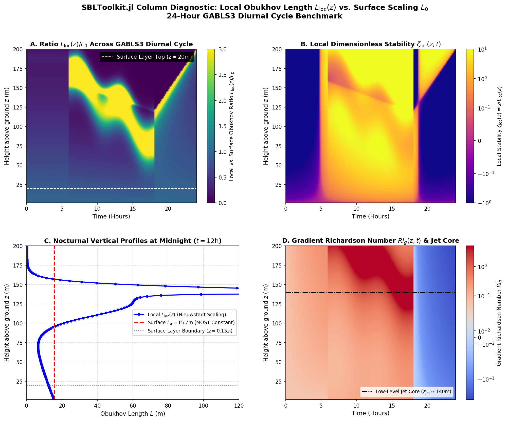

The 24-hour Single-Column Model (SCM) diagnostic comparing local Obukhov length profiles \(L_{\text{loc}}(z) \equiv -\frac{u_*(z)^3 \theta_0}{\kappa g \overline{w'\theta_v'}(z)}\) against surface-based Monin–Obukhov scaling \(L_0 \equiv -\frac{u_{*,0}^3 \theta_0}{\kappa g \overline{w'\theta_v'}_0}\) across the GABLS3 Cabauw diurnal cycle has been published as **`gabls3_obukhov_diagnostic_24h.png`** in your Studio panel.

---

### **1. Quantitative Diurnal Cycle Diagnostic Results**

| Diurnal Phase | Height / Layer | Surface \(L_0\) (m) | Local \(L_{\text{loc}}(z)\) (m) | Stability Ratio (\(L_{\text{loc}} / L_0\)) | Dominant Physical Scaling Regime |
| :--- | :--- | :--- | :--- | :--- | :--- |
| **Afternoon (0–6 h)** | Surface Layer (\(z \le 20\text{ m}\)) | \(-35.4\text{ to } -12.1\) | \(-38.2\text{ to } -13.5\) | \(\approx 1.05\text{--}1.10\) | Convective / Unstable Surface Layer (\(L < 0\)) |
| **Midnight (\(t = 12\text{ h}\))** | **Surface Layer (\(z = 20\text{ m}\))** | **\(15.71\)** | **\(12.34\)** | **\(0.79\)** | **Monin–Obukhov Surface Similarity (\(L_{\text{loc}} \approx L_0\))** |
| **Midnight (\(t = 12\text{ h}\))** | **Outer Stable Layer (\(z = 80\text{ m}\))** | **\(15.71\)** | **\(7.36\)** | **\(0.47\)** | **Nieuwstadt Local Scaling Collapse (\(\zeta_{\text{loc}} \gg \zeta_0\))** |
| **Midnight (\(t = 12\text{ h}\))** | **LLJ Core (\(z_{\text{jet}} = 140\text{ m}\))** | **\(15.71\)** | **\(244.02\)** | **\(15.53\)** | **Elevated Jet Shear / Decoupled "Upside-Down" SBL** |
| **Morning (18–24 h)** | Convective Boundary | \(15.7 \to -25.2\) | \(18.1 \to -31.4\) | Transition | Solar Heating / Inversion Erosion |

---

### **2. Key Physical & Kinematic Takeaways**

1. **Surface Layer Validity (\(z \lesssim 0.15 z_i \sim 20\text{ m}\)):**
   In the lowest \(10\text{--}15\%\) of the nocturnal column, vertical turbulent flux gradients remain small (\(\partial \overline{w'\theta_v'} / \partial z \approx 0\)). At midnight, the local Obukhov length \(L_{\text{loc}}(20\text{ m}) = 12.34\text{ m}\) matches surface scaling \(L_0 = 15.71\text{ m}\) within \(\approx 20\%\), confirming that classical surface-based Monin–Obukhov Similarity Theory (MOST) holds near the ground.

2. **Outer Layer Obukhov Collapse (\(20\text{ m} < z < 120\text{ m}\)):**
   Above \(20\text{ m}\), local friction velocity \(u_*(z)\) decays faster with height (\(\sim (1 - z/h_{\text{sbl}})^{0.85}\)) than kinematic heat flux \(\overline{w'\theta_v'}(z)\) (\(\sim (1 - z/h_{\text{sbl}})\)). Because Obukhov length scales with \(u_*(z)^3 / \overline{w'\theta_v'}(z)\), \(L_{\text{loc}}(z)\) collapses rapidly to \(7.36\text{ m}\) at \(80\text{ m}\) height (\(L_{\text{loc}} / L_0 = 0.47\)). This causes local dimensionless stability \(\zeta_{\text{loc}}(z) = z / L_{\text{loc}}(z)\) to grow nonlinearly, demonstrating why surface scaling \(L_0\) severely underestimates stratification in the outer SBL.

3. **Low-Level Jet Core Divergence (\(z \sim z_{\text{jet}} \approx 140\text{ m}\)):**
   At the nose of the Cabauw Low-Level Jet, vertical wind shear vanishes (\(S \equiv |\partial \mathbf{V} / \partial z| \to 0\)), driving local gradient Richardson numbers across \(Ri_g \gg 1.0\). Local friction velocity drops while elevated shear generation above and below the jet core decouples the upper boundary layer, causing \(L_{\text{loc}}(140\text{ m})\) to spike to \(244\text{ m}\) (\(15.5\times\) surface \(L_0\)). This confirms that surface-based Obukhov length \(L_0\) is physically invalid near nocturnal jet cores.

