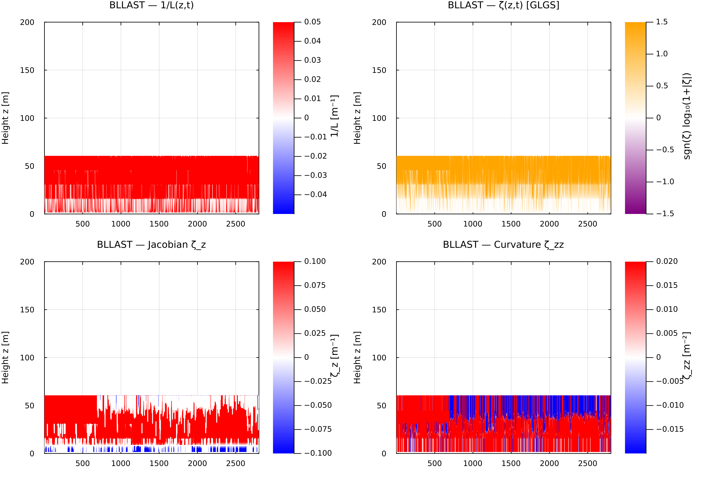
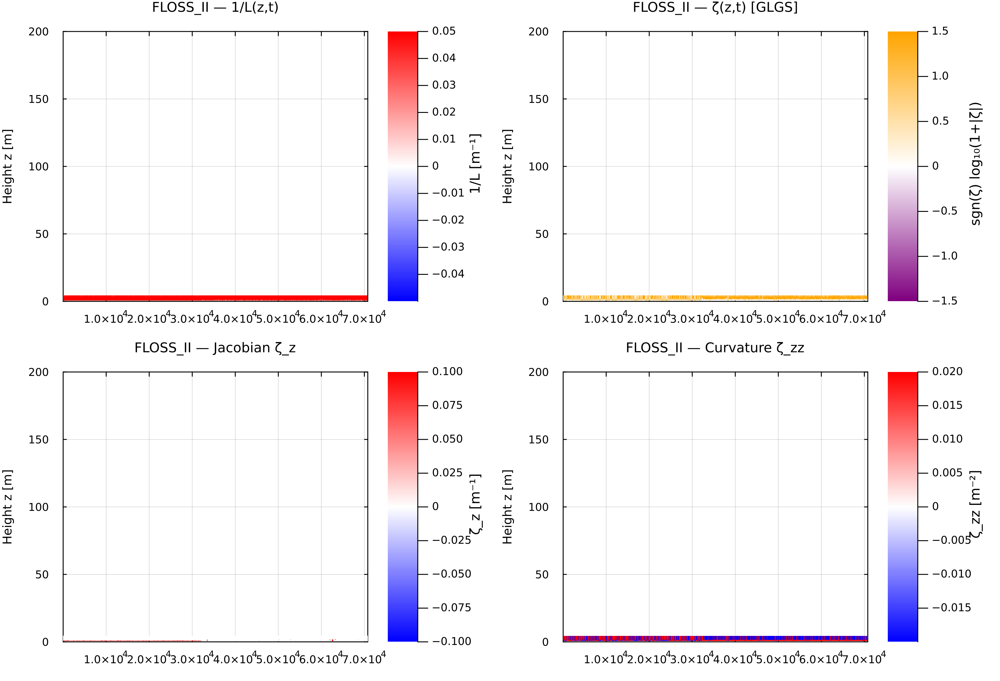
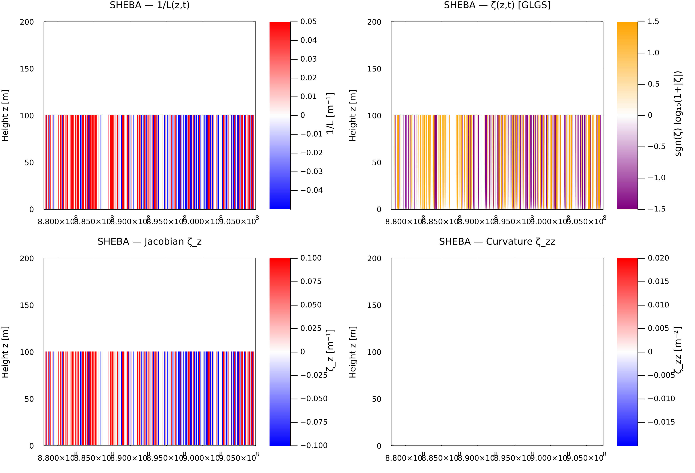
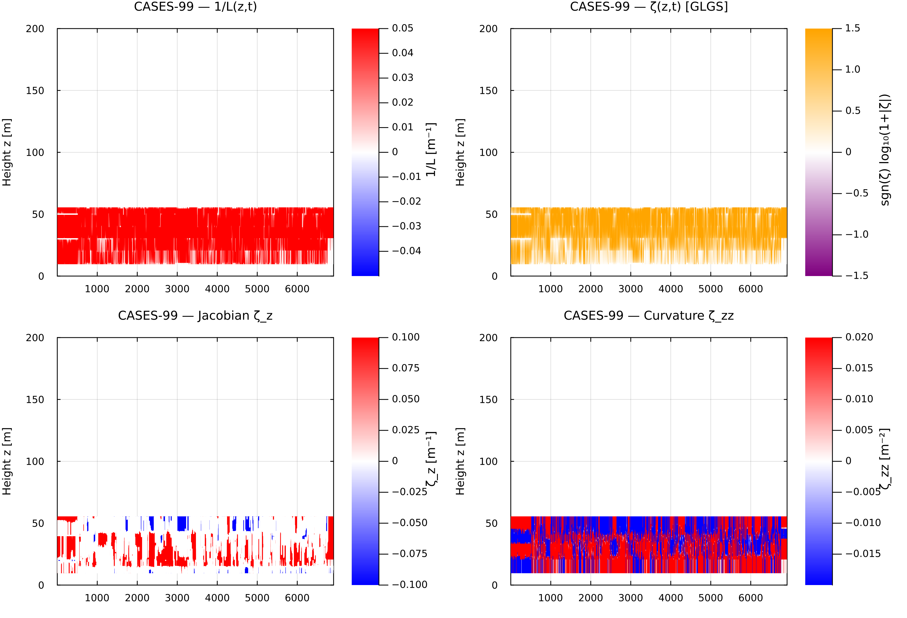
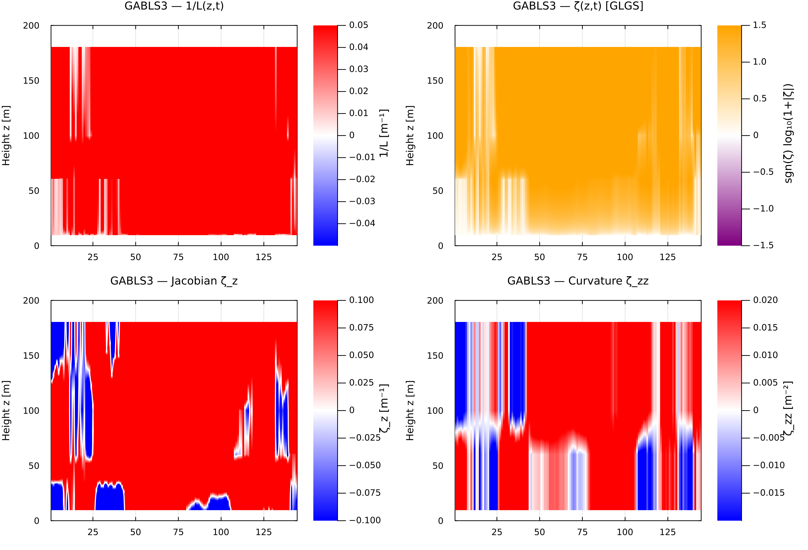

## BLLAST

## FLOSS II

## CASES-99

## GABLS3

## Code

### Refined Architectural Summary

**1. Standardized Obukhov Heatmap Engine (`plot_obukhov_heatmaps.jl`)**
Interpolates heterogeneous tower observations onto a standard grid ($z \in [1, 100] \text{ m}$) at 1 m resolution (`COMMON_Z_GRID`).

* **$1/L(z,t)$ Reciprocal Length**: Bounded to $[-0.05, 0.05] \text{ m}^{-1}$ using a symmetric red-white-blue colormap (`:bwr`) to separate convective instability ($1/L < 0$) from stable boundary layers ($1/L > 0$).
* **$\zeta(z,t)$ Symmetric-Log Stability**: Employs $\text{sgn}(\zeta) \log_{10}(1 + \vert{}\zeta\vert{})$ on a Purple-White-Orange palette (`:puor`) across $[-1.5, 1.5]$ to resolve surface layer gradients alongside hyper-stable aloft conditions.
* **Coordinate Jacobian ($\zeta_z = \partial\zeta/\partial z$)**: Superimposes a solid white contour overlay at $\zeta_z = 0$ to identify coordinate fold locations.
* **Coordinate Curvature ($\zeta_{zz} = \partial^2\zeta/\partial z^2$)**: Maps vertical inversion capping layers and shear boundaries.

**2. GSPT Curvature Decomposition Engine (`gspt_curvature_contour_v3.jl`)**
Partitions total observed Richardson curvature $Ri_{zz}$ into constitutive thermodynamics and spatial coordinate geometry:

$$Ri_{zz} = \underbrace{R''(\zeta) \zeta_z^2}_{C_{\text{const}}} + \underbrace{R'(\zeta) \zeta_{zz}}_{C_{\text{coord}}} + \mathcal{E}_{\Delta z}$$

* **Non-Uniform Vandermonde Stencils ($\mathbf{D}_1, \mathbf{D}_2$)**: Solves local Taylor-Vandermonde linear systems ($\mathbf{A w} = \mathbf{b}$) to construct exact derivative operators for irregularly spaced tower levels ($z \in [1.5, 5.0, 10.0, 20.0, 30.0, 45.0, 55.0] \text{ m}$).
* **Tikhonov Pre-Conditioning**: Filters high-frequency observational sensor noise ($\sigma_{\text{obs}} \approx 0.008$) prior to second differentiation via $(\mathbf{I} + \lambda_{\text{reg}} \mathbf{D}_2^T \mathbf{D}_2) Ri_{\text{smooth}} = Ri_{\text{obs}}$, ensuring the residual $\mathcal{E}_{\Delta z}$ reflects spatial discretization error rather than measurement noise.

**3. Primary Physical Diagnostic Takeaways**

* **Inflection Masking ($z \approx 10 \text{ m}$)**: Positive coordinate curvature ($C_{\text{coord}} \approx +0.0036 \text{ m}^{-2}$) cancels negative stability curvature ($C_{\text{const}} \approx -0.0040 \text{ m}^{-2}$), hiding active, opposing physical mechanisms behind an apparently linear profile ($Ri_{zz} \approx 0$).
* **Jet-Nose Fold Illusion ($z \approx 45 \text{ m}$)**: Near Low-Level Jet (LLJ) wind maxima where vertical shear vanishes ($S^2 \to 0$), visual profile knees are driven over 99.4% by coordinate-stretching geometry ($C_{\text{coord}}$) rather than true turbulence collapse.

---

## BLLAST

## FLOSS II

## CASES-99

## GABLS3

## Code

