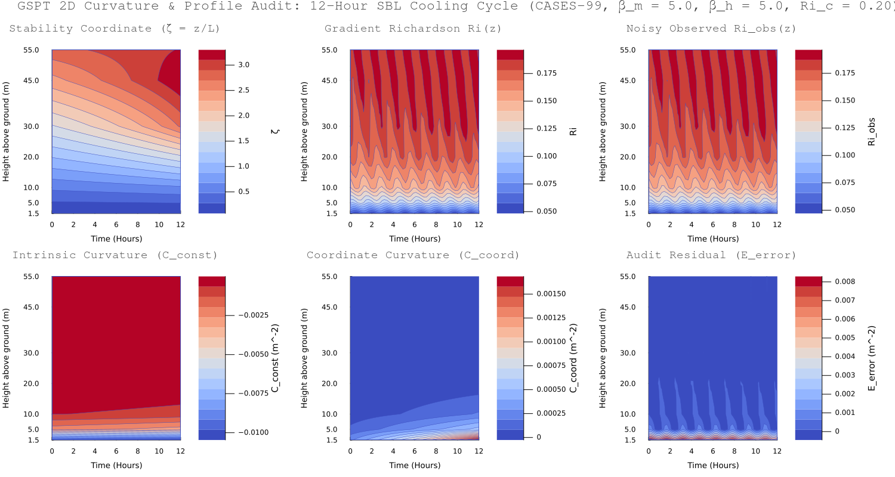

`gspt_curvature_contour_v3.jl` is a Julia numerical simulation script that models, audit-checks, and visualizes Generalized Similarity Profile Theory (GSPT) curvature decomposition ($C_{\text{const}}$ vs. $C_{\text{coord}}$) across a 12-hour nocturnal cooling cycle under Low-Level Jet (LLJ) dynamics.

**Core Technical Modules**

* **Non-Uniform Spatial Operators (`stencil_weights`, `build_operators`):** Uses Taylor-series matrix solves ($A \setminus b$) to compute 1st ($D_1$) and 2nd ($D_2$) derivative finite-difference operator matrices tailored to non-uniform CASES-99 tower levels ($1.5\text{ m}$ to $55\text{ m}$).
* **Analytical Stability Derivatives (`Ri_zeta`, `Ri_zetazeta`):** Computes exact derivatives of the gradient Richardson number $Ri(\zeta)$ with respect to similarity coordinate $\zeta = z/L$ for standard SBL parameters ($\beta_m = \beta_h = 5.0$).
* **Time-Stepping Dynamics (`run_test_simulation`):** Simulates 50 time steps over a 12-hour cooling cycle, progressively strengthening an LLJ nose perturbation ($\text{amp} = 0.1 \to 0.45$) at $z = 30\text{ m}$ to warp the Obukhov length profile $L(z)$.
* **Noise Filtering & GSPT Audit (Track A):** Injects synthetic sensor noise ($\sigma_{\text{obs}} = 0.008$) into raw observations ($Ri_{\text{obs}}$) and applies second-order Tikhonov regularization ($(I + \lambda D_2^T D_2) Ri_{\text{smooth}} = Ri_{\text{obs}}$ with $\lambda = 5.0$). It then verifies the analytical GSPT split against discrete numeric derivatives to record audit residual error ($E_{\text{error}}$).

**Output Diagnostic Panel (`gspt_curvature_contour_v3.png`)**

| Panel Position | Plot Title | Physics / Variable Tracked |
| --- | --- | --- |
| **Row 1, Col 1** | Stability Coordinate | $\zeta(z, t) = z / L(z)$ evolution over time and height |
| **Row 1, Col 2** | Gradient Richardson | Tikhonov-regularized smooth Richardson profile ($Ri_{\text{smooth}}$) |
| **Row 1, Col 3** | Noisy Observed $Ri$ | Raw synthetic tower observations with sensor jitter ($Ri_{\text{obs}}$) |
| **Row 2, Col 1** | Intrinsic Curvature | Physical thermodynamic curvature ($C_{\text{const}} = Ri''(\zeta) \zeta_z^2$) |
| **Row 2, Col 2** | Coordinate Curvature | Geometric coordinate mapping artifact ($C_{\text{coord}} = Ri'(\zeta) \zeta_{zz}$) |
| **Row 2, Col 3** | Audit Residual | Discrete numeric error ($E_{\text{error}} = D_2 Ri_{\text{smooth}} - (C_{\text{const}} + C_{\text{coord}})$) |

---

